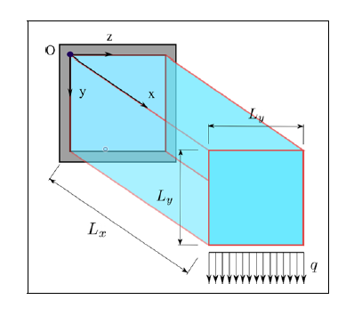

# opt.io - README

opt.io is a MATLAB-based tool that will help you solve basic topology optimization problems, using topology optimization source code modified from Ferrari *et* Sigmund's [2020 paper](https://link.springer.com/article/10.1007/s00158-020-02629-w). It was originally submitted as a final project to Harvard's CS50 course, and has been reuploaded here for public access.

Here, we will 1) run through the setup to get you started and 2) explain the tool's usage. For a brief run-through of the code in video format, please refer to [this](https://youtu.be/LlOsrTvblJs) YouTube video.

## Setup

Download all the contents above and unzip into a directory of your choosing. You will find the following items contained therein:

1. A folder named **Supporting functions**
2. A MATLAB Live Script named **live_optio**
3. A MATLAB Code file named **run_optio**
4. An image named **Indices** (see Usage sections)
4. A Markdown file named **DESIGN**
5. **README.md**

Both **live_optio** and **run_optio** offer similar functionality, but tailored to different use cases and preferences. In brief:

- **live_optio** is perfect for users who are playing around with the tool and prefer a little more guidance. As a MATLAB Live Script, there is a little more interactivity built in, which aids the user experience. The code is also structured such that your inputs are only validated once you are ready, so you can avoid constant error messages as you figure out the appropriate inputs.

- **run_optio** is meant to be called directly from the command line, and its interface is built on dialog boxes. Unlike live_optio, this tool assumes that you are already familiar with the inputs you want. As such, it will validate your entries as you go, and there is no option to go back and revise your settings; you may simply review them at the end (as a confirmation).

To run the code, open MATLAB and set the [Current Folder](https://www.mathworks.com/help/matlab/ref/filebrowser.html) to the directory in which the files above are contained. Select the "Supporting functions" folder, right click, select "Add to Path", and choose "Selected folders". For more details on setting MATLAB search paths (including programmatical implementations), see [here](https://www.mathworks.com/help/matlab/matlab_env/add-remove-or-reorder-folders-on-the-search-path.html).

If you are using **live_optio**, go to "View" and select "Hide Code" to view only the text and controls. This does not apply for **run_optio**.

## Usage: live_optio

As noted above, **live_optio** is built as a MATLAB Live Script and allows input on a single page. As the Live Script already features heavy text-based guidance (as per its purpose as a more hand-holding, user-friendly tool), this section will focus on broad-stroke notes and supplementary information.

At a high level, the **live_optio** workflow is as follows:

1. Select an existing material, or input custom material settings
    - The code requires a Poisson's ratio and a Young's modulus. If you select a custom setting, you will be prompted to input your values when you click "Check & Optimize" below.
2. Define your design space
    - This establishes the number of nodes in each of the 3 cartesian axes with which to run the algorithm. Upon exporting the optimization results, these correspond to a bounding box measured in mm. To achieve a higher-resolution STL output, input larger dimensions that form the same aspect ratio, then scale the STL back down to the correct size.
3. Define your load and constraint
    - These rely on MATLAB syntax to indicate the node indices at which you would like to apply a downward (-Z) load or constrain the design (in all degrees of freedom). Note that the tool currently only allows downward forces,  only one load and constraint can be specified per optimization, the indices must be inputted as comma-separated values, and the indices must fall within your design space (with +1 of headroom; e.g., 24 x elements allows you to index anywhere between 1 and 25). See "Understanding Indices" section below for how these indices correspond to the 3D geometry (**ignore the x, y, and z axes indicated**).
4. Define your optimization settings
    - These are for more advanced users; the defaults noted in **live_optio** will suffice for more use cases. The main setting of interest is likely the maximum number of iterations, which will cap how long the algorithm will run for. Note that, if this value is too low, the algorithm will stop too prematurely for an accurate result (perhaps yielding a faulty STL); the benchmark for "too low" varies on a case-by-case basis.
5. Check your inputs and run the algorithm
    - Only upon clicking the "Check & Optimize" button will your inputs above be validated. If there is an error, you will receive a pop-up with a description. Otherwise, an optimization preview will pop up and update in real time.
6. Get results
    - Upon completion, a new dialog box will open, allowing you to view the result, export it as an STL (for post-processing and/or 3D printing), or finish (clearing the workspace). When viewing the result, you can orbit the entire geometry in 3D.


## Usage: run_optio

**run_optio** is distinct from **live_optio** in that it is based on a series of dialog-box inputs, without the guidance or single-page access of a Live Script. The general workflow, however, is similar to the one indicated above:

1. Select an existing material, or input custom material settings
    - The code requires a Poisson's ratio and a Young's modulus. If you select "Custom", you will be prompted immediately for your input.
2. Define your design space, load, constraint
    - The design space establishes the number of nodes in each of the 3 cartesian axes with which to run the algorithm. Upon exporting the optimization results, these correspond to a bounding box measured in mm. To achieve a higher-resolution STL output, input larger dimensions that form the same aspect ratio, then scale the STL back down to the correct size.
    - These rely on MATLAB syntax to indicate the node indices at which you would like to apply a downward (-Z) load or constrain the design (in all degrees of freedom). Note that the tool currently only allows downward forces,  only one load and constraint can be specified per optimization, the indices must be inputted as comma-separated values, and the indices must fall within your design space (with +1 of headroom; e.g., 24 x elements allows you to index anywhere between 1 and 25). See "Understanding Indices" section below for how these indices correspond to the 3D geometry (**ignore the x, y, and z axes indicated**).
3. Define your optimization settings
    - These are for more advanced users; the defaults will suffice for more use cases. The main setting of interest is likely the maximum number of iterations, which will cap how long the algorithm will run for. Note that, if this value is too low, the algorithm will stop too prematurely for an accurate result (perhaps yielding a faulty STL); the benchmark for "too low" varies on a case-by-case basis.
5. Review your settings and run the optimization
    - Before proceeding, you have the option to review your inputted settings "View settings". To begin optimization, click "Optimize".
6. Get results
    - Upon completion, a new dialog box will open, allowing you to view the result, export it as an STL (for post-processing and/or 3D printing), or finish (clearing the workspace). When viewing the result, you can orbit the entire geometry in 3D.


We highlight some key differences with **live_optio**:

1. The dialog boxes provide different modes of input, e.g., a selection list instead of a dropdown list for the materials, and text boxes instead of sliders for some numerical inputs.
2. The inputs come with default settings, which is convenient when running several optimizations with similar configurations.
3. The program will check your inputs at each dialog box, which can get tedious for first-time users but is helpful for catching errors quickly.
4. You cannot go back to modify any settings that you have already inputted; you will have to start over. Before committing any time or computational power to the optimization algorithm, you have the option to review your inputs and abort in the case of errors.

To run **run_optio**, either type

```
run_optio
```
into the MATLAB command line, or go to the "Editor" tab and click "Run".

## Understanding Indices

Below is a figure visualizing how indices relate to 3D geometry:



*Fig. 1. Visualization of how indices correspond to 3D geometry, to aid load/constraint selection. This example constrains the ZY face and applies a load to the furthest bottom edge with the following settings:*

```python
No. of x elements: 24
No. of y elements: 12
No. of z elements: 12

Load indices: "25, 1:13, 1"
Constraint indices: "1, 1:13, 1:13"
```
Again, please **ignore** the axes drawn in the figure; it is simply meant to visualize the constrained face and loaded edge.

Observe also that, as indicated above, you may index up to the number of elements + 1. This is an artifact of the way the topology optimization source code is structured.

## Acknowledgments
The topology optimization code used herein is based heavily on the work of [Ferrari *et* Sigmund, 2020](https://link.springer.com/article/10.1007/s00158-020-02629-w).

I thank the CS50 course staff for their continued support and assistance.
